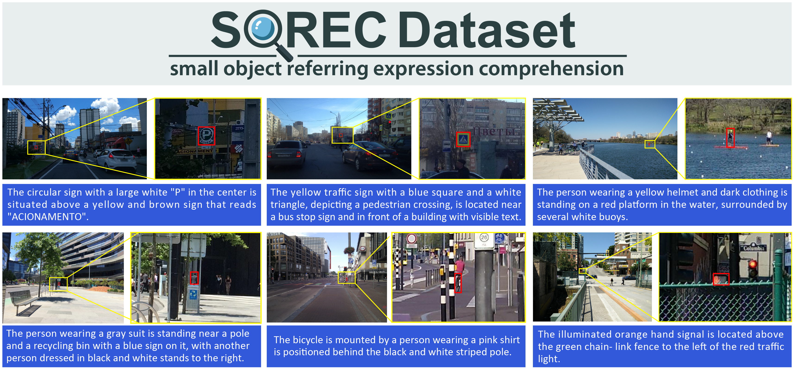

# Referring Expression Comprehension for Small Objects



## 📝 Abstract

Referring expression comprehension (REC) aims to localize the target object described by a natural language expression.
Recent advances in vision-language learning have led to significant performance improvements in REC tasks.
However, localizing extremely small objects remains a considerable challenge despite its importance in real-world applications such as autonomous driving.
To address this issue, we introduce a novel dataset and method for REC targeting small objects.
First, we present the small object REC (SOREC) dataset, which consists of 100,000 pairs of referring expressions and corresponding bounding boxes for small objects in driving scenarios.
Second, we propose the progressive-iterative zooming adapter (PIZA), an adapter module for parameter-efficient fine-tuning that enables models to progressively zoom in and localize small objects.
In a series of experiments, we apply PIZA to GroundingDINO and demonstrate a significant improvement in accuracy on the SOREC dataset. This repository contains our dataset and code.

## News
**2025/07/30**: SOREC is released🔥.

## SOREC dataset

The SOREC dataset consists of 100,000 pairs of referring expressions and corresponding bounding boxes for small objects in road, highway, rural, and off-road images. You can download json files from the links below:

- 📂 [Train-S](./dataset/sorec/trainS.json): Small training dataset (10,000 referring expressions)
- 📂 [Train-L](./dataset/sorec/trainL.json): Training dataset (61,369 referring expressions)
- 📂 [Val](./dataset/sorec/val.json): Validation dataset (10,712 referring expressions)
- 📂 [Test-A](./dataset/sorec/testA.json): Test dataset for traffic objects (10,815 referring expressions)
- 📂 [Test-B](./dataset/sorec/testB.json): Test dataset for other objects (17,104 referring expressions)
- Please download images from [SODA-D dataset](https://shaunyuan22.github.io/SODA/)

Each entry in the JSON file consists of the following fields:

- 🖼️ image: File name of the image being annotated.
- 🚗 bbox: Bounding box of the target object in the image. It is represented as an array of four integers in the format `[x, y, width, height]`.
- 📝 ref: Textual reference expression that describes the target object within the image.

 ```json
    {
        "image": "10849.jpg",
        "bbox": [
            1011,
            1056,
            21,
            39
        ],
        "ref": "The blue parking sign with white text reading P in white is situated above and to the left of the blue informational sign."
    },
```

## License
The code and the model weights in this repository is released under the MIT license as found in the [LICENSE file](LICENSE).


## Citation

Please cite this repository as bellow.
```

```
